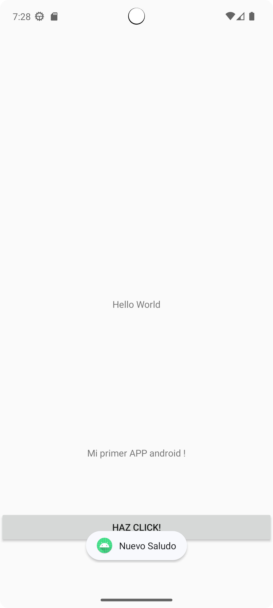
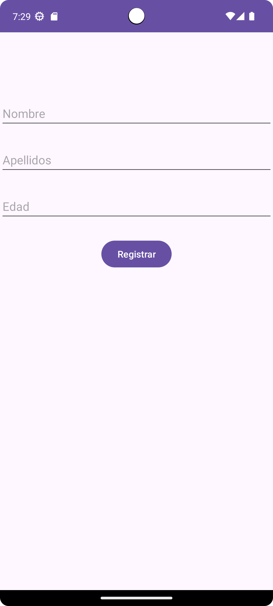
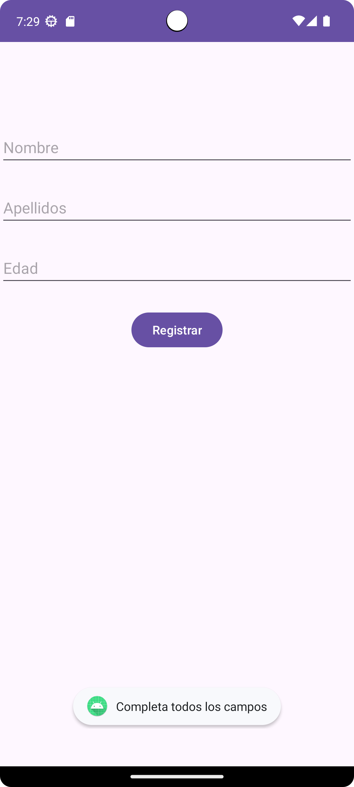
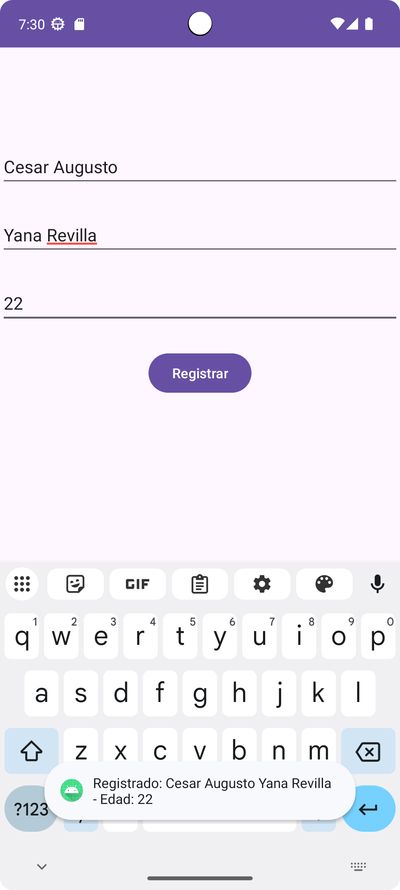
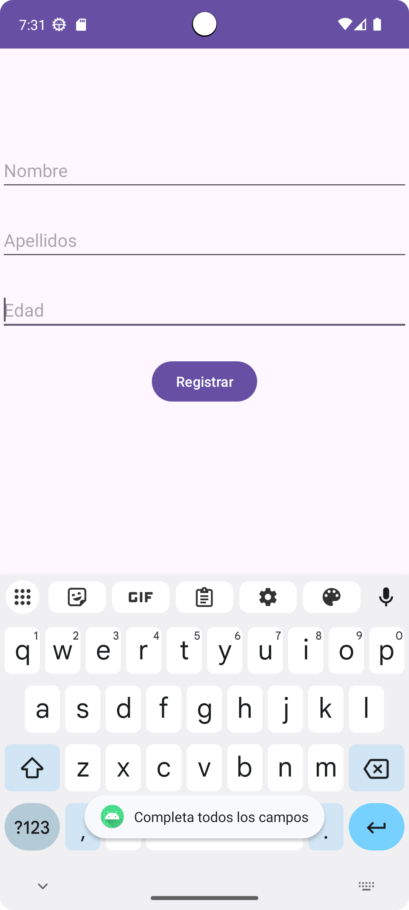
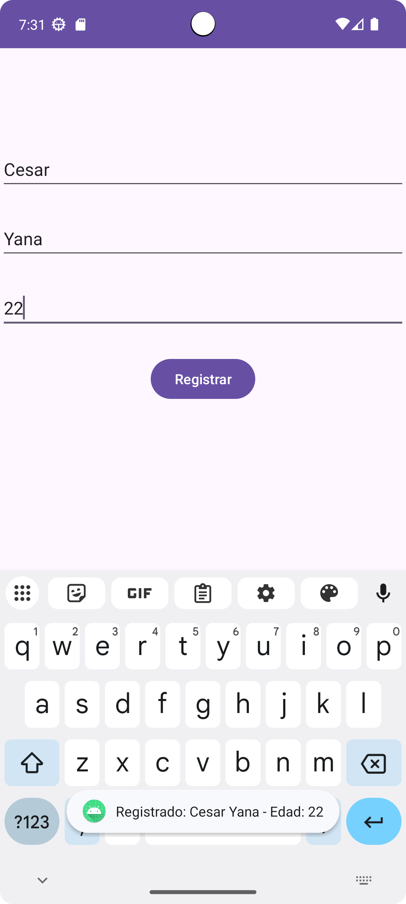

App Registro de Estudiantes
Descripción

Aplicación móvil desarrollada en Android Studio para registrar datos de estudiantes (nombre, apellidos y edad), usando Java y Kotlin.

Actividad Inicial

**Interfaz**

**Acción del botón**

---

## Ejercicio 1 – Java

**Interfaz**

**Validación de campos**

**Confirmación de registro**

---

## Ejercicio 2 – Kotlin

**Validación de campos**

**Confirmación de registro**

---
